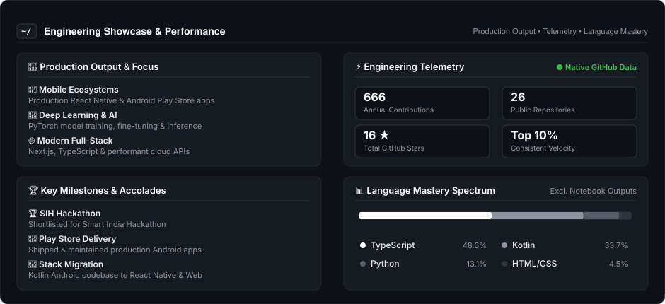

  
  
    

  # Sonu Kumar
  
  

    
  

  ### 📊 Turning Data Into Insights
  
  **Data Analyst • Power BI Specialist • AI & ML Enthusiast**

   

  
  &nbsp;
  

---

### 👨‍💻 About Me

I'm a **Data Analyst** passionate about turning raw data into meaningful insights and
building dashboards that help people make better decisions.

* 📊 **Analytics:** Working with **SQL, Python, Excel, and Power BI** to explore and analyze data.
* 📈 **Visualization:** Creating interactive **Power BI dashboards** and clear data visualizations.
* 🧠 **AI & ML:** Exploring **Machine Learning and Deep Learning** to solve real-world problems.
* 🔍 **Problem Solving:** Interested in discovering patterns, trends, and actionable insights from data.
* 🚀 **Projects:** Building practical data analytics projects and continuously improving my technical skills.

---

### 📡 Technical Capability & Skills Radar

  

---

### 🛠️ Core Tooling & Technologies

| **Category** | **Technologies** |
| :--- | :--- |
| **Data Analytics & BI** |  |
| **Python & Data Science** |  |
| **AI & Machine Learning** |  |
| **Mobile & App Dev** |  |
| **Web Development** |  |
| **Tools & Platforms** |  |

---

### 📈 Activity & Contribution Flow

  

---

### ⚡ Engineering Showcase & Performance

  

---

### 🎮 The Human Side

I'm not just a code machine. When the IDE closes, here is who I am:

* **📊 Data Mindset:** I enjoy finding patterns, trends and insights hidden inside data.
* **🧠 Continuous Learning:** Always exploring new tools, technologies and better ways to solve problems.
* **🤖 AI Philosophy:** I believe AI should amplify human creativity, productivity and decision-making.

---

  Turning data into insights, ideas into solutions. 🚀

